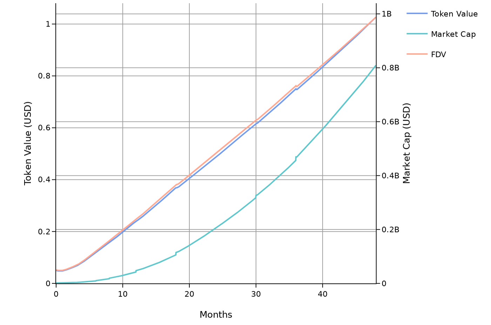
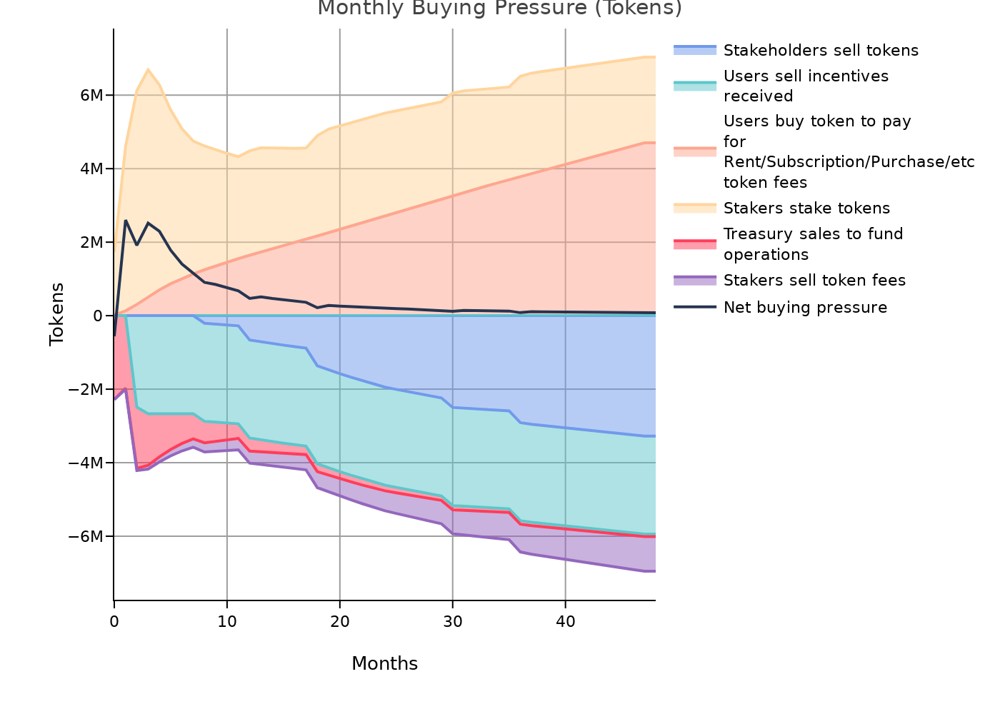
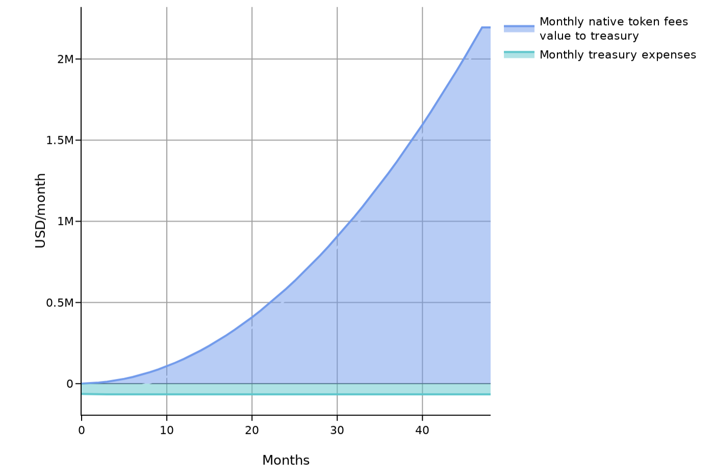

# SEP-003: MMC Token Economics

**Status:** Draft **|** **Category:** Economics

**Discussions-to:** [SEP-003: MMC Token Economics](https://github.com/orgs/Synaps3Protocol/discussions/6)

Currently envisages to having a maximum supply of **1,000,000,000** tokens, ensuring scarcity and supporting long-term value. These tokens will be vested over a total of 72 months. During the private sale, **10%** of the **total supply (100,000,000 MMC)** will be offered, with a target to raise **$10,000,000**.

## 1.1 Initial Price

The initial price per token is determined as:

*Initial Price per Token = Target Funds / Tokens Allocated for Private Sale*

To ensure market stability and liquidity:

- 50% of the funds raised will be allocated to Market Makers.
- This strategy guarantees smooth transactions, improves token liquidity, and reinforces investor confidence.
- The limited supply ensures tokens remain scarce, reducing the risk of sudden influxes that could cause major price swings.
- Over time, this enhances value retention as demand grows and the token becomes a sought-after asset.

## 1.2 Allocation and Vesting Schedule

The MMC Token distribution is designed to incentivize early adopters, contributors, and network participants while ensuring ecosystem sustainability. 
**All vesting schedules follow a “cliff + linear” model.** This means that during the cliff period no tokens are released, and once the cliff is reached, tokens are unlocked proportionally (linearly) across the remaining vesting duration.
The allocation and vesting of tokens are as follows:

| Entity                           |   Allocation (%) |   Vesting Start (month) |   Vesting Cliff (month) |   Vesting Duration (months) |
|:---------------------------------|-----------------:|------------------------:|------------------------:|----------------------------:|
| Cex/Dex                          |                5 |                       0 |                       0 |                           0 |
| Investors Round 1                |                7 |                      12 |                       6 |                          18 |
| Investors Round 2                |                5 |                      30 |                       6 |                          18 |
| Investors Round 3                |                3 |                      48 |                       3 |                          18 |
| Founder/Team Round 1             |                4 |                       0 |                      12 |                          24 |
| Founder/Team Round 2             |                5 |                      24 |                       6 |                          24 |
| Founder/Team Round 3             |                6 |                      48 |                       3 |                          24 |
| Initial Network Reserve          |                6 |                       0 |                       0 |                          48 |
| Rewards & Incentives             |               12 |                       2 |                       0 |                          60 |
| Content Growth & Support 1       |                6 |                       6 |                       0 |                          36 |
| Content Growth & Support 2       |                5 |                      36 |                       0 |                          24 |
| Marketing                        |                5 |                       6 |                       0 |                          36 |
| Ecosystem Growth & Partnership 1 |                7 |                       0 |                       0 |                          36 |
| Ecosystem Growth & Partnership 2 |                5 |                      36 |                       0 |                          24 |
| Research & Development           |                5 |                       6 |                       0 |                          36 |
| Private Sale                     |               10 |                       0 |                       8 |                          36 |
| Advisors/Legals                  |                4 |                       0 |                       6 |                          24 |

## 1.3 Distribution Mechanism (Token Distribution)

The MMC Token distribution is designed to incentivize early adopters, contributors, and network participants while ensuring the ecosystem's sustainability. Key mechanisms include:

- **Conditional Exclusive Airdrops**: Rewards for loyalty, early adoption during testnet, and early creators.  
  _(Details: [HackMD Airdrops](https://hackmd.io/@cKICHHrfSOqOUrWKb1sFbg/Sy9sinJMJx))_
- **Private Sale**: Raising initial funds for product development, operations, and team expansion.
- **Vesting**: Gradual token releases for long-term stakeholders.
- **Grants & Partnerships**: Supporting ecosystem growth through strategic collaborations.
- **Rewards**: Distributed for engaging in quests, staking, governance, prizes, and community activities.
- **Content Growth & Support**: Incentivizing the creation, curation, and expansion of high-quality content within the platform.
- **Network Effects Support**: Encouraging behaviors like:
  - Providing valuable feedback.
  - Uploading high-quality content.
  - Building a strong reputation.
  - Referrals that expand the user base.

## 1.4 Inflation/Deflation Model

Although token releases are not technically inflationary (since no new tokens are minted), they influence the circulating supply, impacting supply and demand dynamics. The MMC Token employs a balanced inflation/deflation mechanism to ensure long-term sustainability.

### 1.4.1 **Inflationary Faucet**
Tokens are distributed and added to the circulating supply through the mechanisms listed in **1.3**, including:

- Staking rewards.
- Network Effects Support.
- Airdrops.

### 1.4.2 **Deflationary Sink**
Tokens are strategically removed or temporarily locked to reduce the circulating supply, leveraging mechanisms like:

- **Token Burn**: A portion of fees is permanently removed from circulation.
- **Fees**: A percentage of collected fees is removed or redirected.
- **Locking**: Temporarily removing tokens for specific purposes.
- **Buybacks & Treasury Locking**: Tokens purchased from the market are either stored in the treasury or burned.
- **Staking**: Temporarily locks tokens, reducing the active circulating supply.

### 1.4.3 **Future Approach**
We plan to adopt a hybrid model combining:

- **Token emissions based on new content** (as an inflationary mechanism).
- **Token burns** (as a deflationary mechanism).

In the long term, combining token emissions and burns balances supply and demand, stabilizes token value, and promotes sustainable ecosystem growth. This hybrid model incentivizes new content creation while controlling inflation and maintaining scarcity, ensuring a robust and engaged blockchain community.

## 1.5 Fee Rate & Distribution

The protocol charges a **5%** initial fee on transactions, distributed as follows:

- **Treasury: 50%**  
  Supports ecosystem growth, grants, development, and operational costs.
- **Staking Pool: 20%**  
  Incentivizes participants staking MMC Tokens.
- **Burn Rate: 30%**  
  Permanently removes tokens to create scarcity and stabilize value.

## 1.6 Governance and Voting Rights

MMC Token holders play a crucial role in the decentralized governance of our ecosystem. Governance is powered by a token-weighted voting system, where the voting power of participants is directly proportional to the number of MMC Tokens they hold. This system ensures that those most invested in the platform have a meaningful voice in its direction, fostering a sense of responsibility and accountability within the community.

### **Governance Process**
1. **Proposal Submission**
2. **Community Discussion**
3. **Voting Preparation**
4. **Voting Period**
5. **Proposal Implementation or Execution**

The community actively shapes the future of the ecosystem by voting on:

- **Fee Rate**: Adjust transaction fee rates.
- **Deflation Control**: Adjust the Token burn rate.
- **Treasury Administration**: Allocate funds for ecosystem development, network support, and partnerships.
- **Content Curation**: Verify and curate high-quality content within the platform.
- **Validation of Distribution Network**: Approve and onboard nodes responsible for content delivery and network operations.

## 1.7 Projected Organic Growth of the Token Economy

The features detailed above have been introduced into the [Space and Tokens simulation platform](https://cenit.finance) to project the evolution of the token economy over time. These projections focus on the organic growth of the token economy, that is, on the buying and selling pressure coming from protocol users, and not on speculative trading. The full simulation results are available [here](https://spaceandtokens.ai/simulation/71136d43-fa5e-4db2-958b-6f296a4a3265).

The results projected here are based on growth assumptions for the Rent/Subscription/Purchase/etc value proposition, reflected in the following chart:

### Token price and market cap

Based on the simulation results, the MMC token is expected to evolve in value as follows:

### Supply and inflation

### Protocol fees

The following chart showcases how the fees generated by the protocol are expected to evolve over time, and how they will be distributed.

By year 4, the protocol is expected to have generated a total value of approximately $76100000 in fees. This is comes from estimating an average service fee of 5.0 %.

### Treasury

The treasury is expected to have the following profit and loss:

The treasury is expected to have the following funds under management:

By year 4, the treasury is expected to have a total value of approximately $439000000 under management, with 99% in native tokens and 0% in other currencies.

