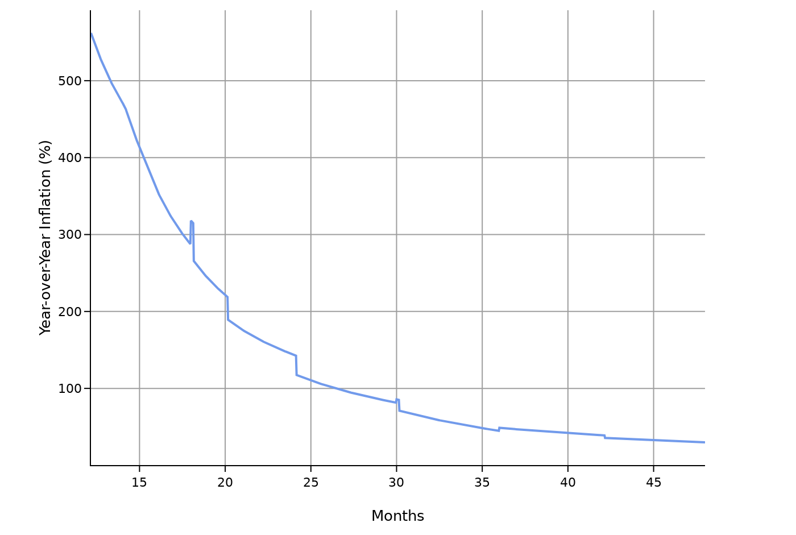
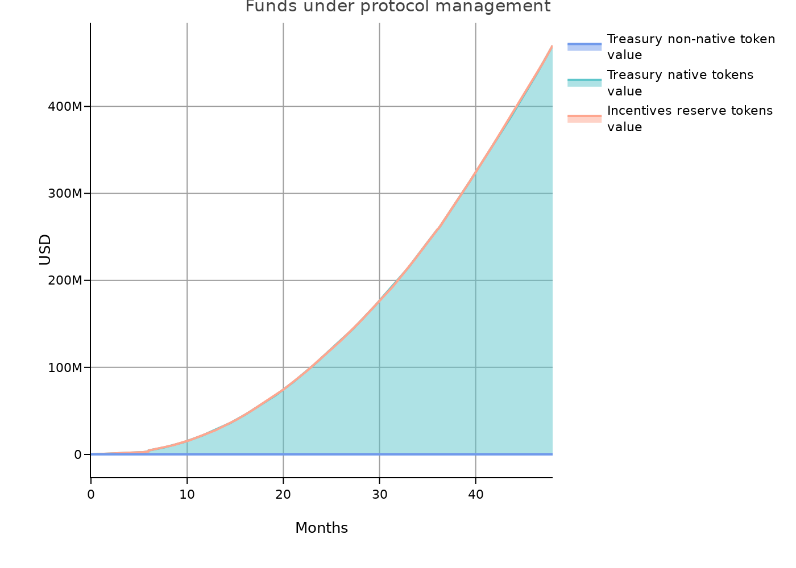

# SEP-003: MMC Token Economics

**Status:** Draft **|** **Category:** Economics

**Discussions-to:** [SEP-003: MMC Token Economics](https://github.com/orgs/Synaps3Protocol/discussions/6)

## Abstract

This document outlines the economic structure and utility framework of the MMC token, including its issuance, allocation, vesting schedules, distribution mechanisms, inflationary and deflationary mechanisms, fee structures, governance model, and projected economic impact. The proposal seeks to ensure the long-term sustainability of the MMC ecosystem by establishing a tokenomic framework that incentivizes adoption, supports network participants, and aligns stakeholder interests.

## 1.1 Token Supply and Initial Distribution

The total maximum supply of **1,000,000,000** MMC tokens is designed to ensure scarcity and long-term value preservation. During the private sale, **5%** of the total supply (**100,000,000 MMC**) will be allocated, targeting a fundraising goal of **$5,000,000**.

## 1.2 Initial Price Determination

The initial price per token is derived from the following formula:

> **Initial Price per Token = Target Funds / Tokens Allocated for Private Sale**

To mitigate volatility and enhance market stability:

- 60% of the capital raised will be allocated to liquidity provision via Market Makers.
- A fixed token supply minimizes the risk of supply shocks, ensuring gradual and organic value appreciation.
- Market-making strategies will support a balanced liquidity environment and minimize excessive price fluctuations.

## 1.3 Allocation and Vesting Schedule

MMC token distribution is structured to ensure long-term sustainability while rewarding key stakeholders. The vesting schedule employs a **cliff + linear model**, where:

- Tokens remain locked during the cliff period.
- Post-cliff, tokens unlock gradually in equal increments over the designated vesting duration.

| Entity                           |   Allocation (%) |   Vesting Start (month) |   Vesting Cliff (month) |   Vesting Duration (months) |
|:---------------------------------|-----------------:|------------------------:|------------------------:|----------------------------:|
| Cex/Dex                          |                3 |                       0 |                       0 |                           0 |
| Investors Round 1                |                7 |                      12 |                       6 |                          18 |
| Investors Round 2                |                5 |                      30 |                       6 |                          18 |
| Founder/Team Round 1             |                4 |                       0 |                      12 |                          24 |
| Founder/Team Round 2             |                5 |                      24 |                       6 |                          24 |
| Founder/Team Round 3             |                6 |                      48 |                       3 |                          24 |
| Initial Network Reserve          |                8 |                       0 |                       0 |                          48 |
| Rewards & Incentives             |               15 |                       2 |                       0 |                          60 |
| Content Growth & Support 1       |                6 |                       0 |                       0 |                          36 |
| Content Growth & Support 2       |                7 |                      36 |                       0 |                          36 |
| Marketing                        |                5 |                       3 |                       0 |                          36 |
| Ecosystem Growth & Partnership 1 |                7 |                       0 |                       0 |                          36 |
| Ecosystem Growth & Partnership 2 |                5 |                      36 |                       0 |                          24 |
| Research & Development           |                6 |                       6 |                       0 |                          36 |
| Private Sale                     |                5 |                       0 |                       8 |                          36 |
| Advisors/Legals                  |                4 |                       0 |                       6 |                          24 |

**Note on Investor Allocations**

- *Investors Round 1 & 2* refer to structured fundraising rounds involving institutional investors and strategic partners, such as those commonly categorized as Seed or Series A. These participants were granted token allocations with specific vesting schedules reflecting their respective entry stages and long-term alignment with the project.
- The *Private Sale* allocation is designated for selected early supporters and strategic collaborators who were granted access prior to the public phase. These allocations are subject to longer lock-up periods and vesting terms to ensure sustained commitment to the protocol’s development.

These categories are distinct: the Investors Rounds involved institutional financing under formal agreements, while the Private Sale was conducted under restricted access, without any public offering, and in compliance with applicable jurisdictional requirements.

## 1.4 Distribution Mechanism (Token Distribution)

The MMC Token distribution is designed to incentivize early adopters, contributors, and network participants while ensuring the ecosystem's sustainability. Key mechanisms include:

- **Conditional Exclusive Airdrops**: Rewards for loyalty, early adoption during testnet, and early creators.  
  _(Details: [Loyalty Points](https://hackmd.io/@gmena/BkymEWL9yx))_
- **Private Sale**: Raising initial funds for product development, operations, and team expansion.
- **Vesting**: Gradual token releases for long-term stakeholders.
- **Grants & Partnerships**: Supporting ecosystem growth through strategic collaborations.
- **Rewards**: Distributed for engaging in quests, staking, governance, prizes, and community activities.
- **Content Growth & Support**: Incentivize the creation and expansion of high-quality content within the platform.
- **Nodes Incentives**: Ensuring long-term incentives for network participants.
- **Network Effects Support**: Encouraging behaviors like:
  - Providing valuable feedback.
  - Onboarding high-quality content.
  - Building a strong reputation.
  - Referrals that expand the user base.

## 1.5 Token Utility & Use Cases

MMC serves as the foundational asset within the ecosystem, supporting:

1. **Staking**: MMC holders stake tokens to earn rewards.
2. **Governance**: Influence protocol decisions via token-weighted voting.
3. **Content Access**: Used for content monetization models (subscriptions, rentals, paywalls).
4. **Premium Services**: Unlock AI analytics, marketing tools, and content processing.
5. **Rights Market**:  Enable decentralized IP trade and leasing.
6. **IP Lending/Borrowing**: Provide liquidity through collateralized IP.
7. **Creator Crowdfunding**: Fund creative proposals and participate in fractional ownership.
8. **Audience Interaction**: Enable tips, live sessions, commissions, and microtransactions.

## 1.6 Inflation/Deflation Model

Although token releases are not technically inflationary (since no new tokens are minted), they do affect the circulating supply, impacting supply and demand dynamics. The MMC Token employs a balanced inflation/deflation mechanism to ensure long-term value.

### 1.6.1 **Inflationary Faucet**
Tokens are distributed and added to the circulating supply through the mechanisms listed in **1.4**, including:

- Staking rewards.
- Network Effects Support.
- Airdrops.

### 1.6.2 **Deflationary Sink**
Tokens are strategically removed or temporarily locked to reduce the circulating supply, using methods like:

- **Token Burn**: A portion of fees is permanently removed from circulation.
- **Fees**: A percentage of collected fees is removed or redirected.
- **Locking**: Temporarily removing tokens for specific purposes.
- **Buybacks & Treasury Locking**: Tokens purchased from the market are either stored in the treasury or burned.
- **Staking**: Temporarily locks tokens, reducing the active circulating supply.

### 1.6.3 **Future Approach**
A hybrid model is planned, combining:

- **Token emissions based on new content** (as an inflationary mechanism).
- **Token burns** (as a deflationary mechanism).

In the long run, the combination of emissions and burns balances supply and demand, stabilizes the token’s value, and promotes sustainable ecosystem growth. This hybrid model incentivizes new content creation while controlling inflation and maintaining scarcity, fostering a robust and engaged blockchain community.

## 1.7 Fee Rate & Distribution

The protocol applies an initial **5%** fee on transactions, distributed as follows:

- **Treasury: 50%**  
  Supports ecosystem growth, grants, development, and operational costs.
- **Staking Pool: 20%**  
  Incentivize participants who stake MMC Tokens.
- **Burn Rate: 30%**  
  Permanently removes tokens to create scarcity and stabilize value.

## 1.8 Governance and Voting Rights

MMC Token holders play a crucial role in the decentralized governance of the ecosystem. A token-weighted voting system is used, where participants’ voting power is directly proportional to the number of MMC Tokens they hold. This ensures that those most invested in the platform have a meaningful voice in shaping its direction, fostering responsibility and accountability within the community.

### Governance Process

1. **Proposal Submission**
2. **Community Discussion**
3. **Voting Preparation**
4. **Voting Period**
5. **Proposal Implementation/Execution**

Through governance, the community can influence aspects such as:

- **Fee Rate**: Adjusting the percentage applied to transactions.
- **Deflation Control**: Modifying the token burn rate.
- **Treasury Administration**: Allocating funds for ecosystem development, network support, and partnerships.
- **Content Supply Verification**: The community may review or refine content specifically during the onboarding process, ensuring alignment with initial guidelines and standards.
- **Content Regulation**: The community may continuously monitor and oversee content within the network (for example, by veto) whenever it violates community guidelines, security, or legal requirements on the long term.
- **Validation of the Distribution Network**: Approving and onboarding nodes responsible for content delivery and network operations

---

## 1.9 Projected Organic Growth of the Token Economy

The features detailed above have been introduced into the [Space and Tokens simulation platform](https://cenit.finance) to project the evolution of the token economy over time. These projections focus on the organic growth of the token economy, that is, on the buying and selling pressure coming from protocol users, and not on speculative trading. The full simulation results are available [here](https://spaceandtokens.ai/simulation/71136d43-fa5e-4db2-958b-6f296a4a3265).

The following chart illustrates the growth assumptions for rent/subscription/purchase services:

### Token price and market cap

Based on the simulation, the MMC Token is projected to evolve in value as follows:

### Supply and inflation

### Protocol fees

The chart below shows how protocol fees are expected to evolve over time and how they will be distributed:

By year 4, the protocol is expected to have generated a total value of approximately **$76,100,000** in fees, assuming an average fee rate of **5%**.

### Treasury

Below is the projected profit and loss (P&L) for the treasury:

The following graph shows the expected funds under management:

By year 4, the treasury is projected to manage a total value of approximately **$431,000,000**, with 99% held in native tokens.

### Conclusion

By implementing these features, the MMC Token becomes a robust instrument for governance, content creation, technological innovation, and financial sustainability within the protocol. This framework ensures an evolving, diverse, and decentralized ecosystem that supports long-term growth.
