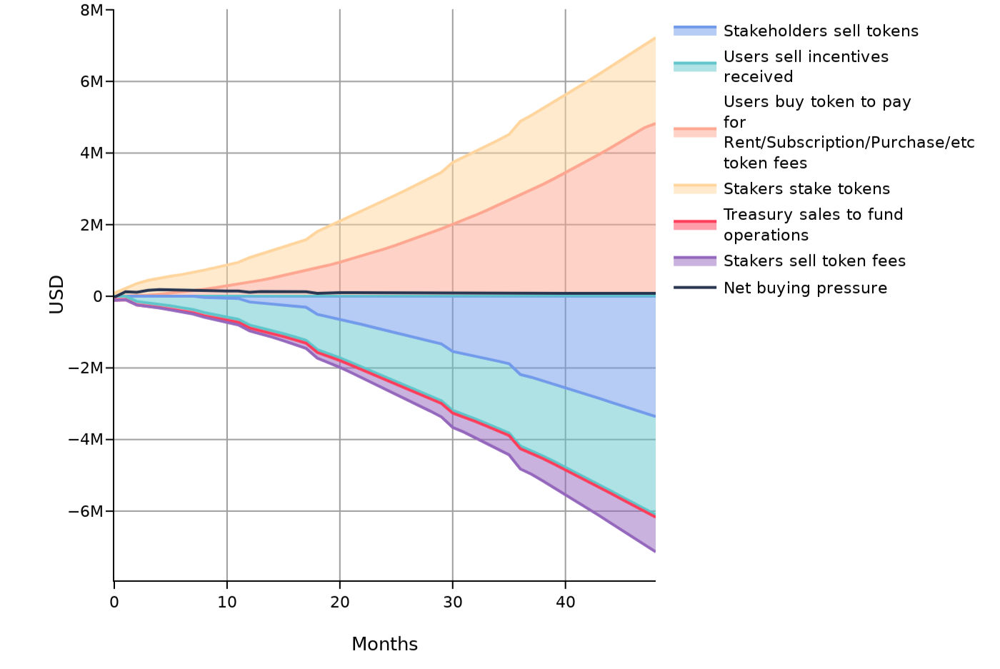
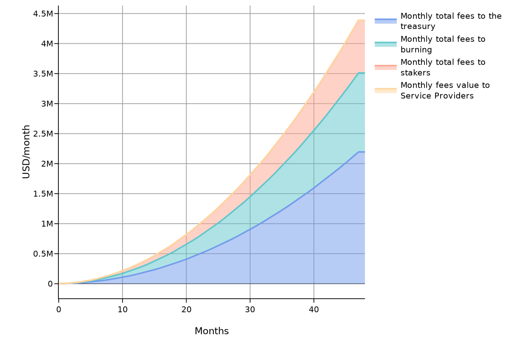

# SEP-003: MMC Token Economics

**Status:** Draft **|** **Category:** Economics

**Discussions-to:** [SEP-003: MMC Token Economics](https://github.com/orgs/Synaps3Protocol/discussions/6)

## Abstract

This document outlines the economic structure and utility framework of the MMC token, including its issuance, allocation, vesting schedules, distribution mechanisms, inflationary and deflationary mechanisms, fee structures, governance model, and projected economic impact. The proposal seeks to ensure the long-term sustainability of the MMC ecosystem by establishing a tokenomic framework that incentivizes adoption, supports network participants, and aligns stakeholder interests.

## 1.1 Token Supply and Initial Distribution

The total maximum supply of **1,000,000,000** MMC tokens is designed to ensure scarcity and long-term value preservation. During the LBR, **5%** of the total supply (**50,000,000 MMC**) will be allocated, targeting a fundraising goal of **$2,500,000**.

### Use of LBR Sale Funds:
This allocation ensures ample initial liquidity, reducing price volatility risks, while adequately funding critical operational activities during cold start.
- 80% of capital raised will be allocated to liquidity provision via Market Makers or protocol-managed liquidity strategies (e.g., Arrakis, GYSR).
- 20% is reserved to strengthen post-TGE growth initiatives not covered by Seed capital, including regulatory compliance, market making strategies, 
and scaling the team to support upcoming growth.

> Note: The matching MMC is sourced from the 7% CEX/DEX Liquidity allocation, ensuring that LBR purchasers’ tokens remain fully locked for 8 months. 
The USDC raised in the LBR, combined with MMC from the Liquidity bucket, seeds the Protocol-Owned Liquidity (POL) pool, 
reinforcing market stability. LBR participants contribute to the ecosystem by enabling protocol liquidity. 
No assurance is provided regarding resale opportunities or token value changes in secondary markets, 
and any returns are strictly limited to proportional liquidity pool fees generated through protocol usage. 
This framework aligns with the SEC’s ([TurnKey Jet no‑action precedent](https://www.sec.gov/divisions/corpfin/cf-noaction/2019/turnkey-jet-040219-2a1.htm)).

## 1.2 Initial Price Determination

The initial token price in the LBR is not a market valuation, but an operational calculation to determine the MMC quantity allocated per USDC contributed:

> **Initial Price per Token = $ 2,500,000 ÷ 50,000,000 MMC = $0.05 per MMC**

This conversion rate defines only the token allocation within the LBR context and must not be interpreted as an implied or future market value.
Subsequent funding rounds for growth are structured with premiums to reflect ecosystem development milestones, not as guarantees of market valuation:

| Round               | Price (USD)                             | Discount/Premium vs LBR | Raise target |
| ------------------- | --------------------------------------- | ----------------------- | ------------ |
| **Seed (SAFT)**     | 0.04                                    | −20 %                   | ≈ US $ 1.2 M |
| **LBR (TSA)**       | 0.05                                    | —                       | US $ 2.5 M   |
| **Strategic (TSA)** | ≥ max(0.06 USD, CurrentPrice × 1.2)     | ≥ +20 %                 | ≤ US $ 3 M   |

FDV hard‑caps: ≤ US $50M (Seed), ≤ US $60M (LBR), ≤ US $80M (Strategic).
> These caps are guidelines for treasury and fundraising strategy, not forecasts of market capitalization.
The token price evolution, if any, is expected to emerge organically from actual utility and ecosystem growth. 
Neither the LBR price, nor subsequent fundraising rounds, are determinative of future market prices.

## 1.3 Allocation and Vesting Schedule

MMC token distribution is structured to ensure long-term sustainability while rewarding key stakeholders. The vesting schedule employs a **cliff + linear model**, where:

- Tokens remain locked during the cliff period.
- All cliffs and linear streams start counting from the **Token Generation Event (TGE)**.
- Post-cliff, tokens unlock gradually in equal increments over the designated vesting duration.

| Entity                           | Allocation (%) | Vesting Start (month) | Cliff (months) | Vesting Duration (months) | Notes |
|:---------------------------------|---------------:|----------------------:|---------------:|--------------------------:|:------|
| Market Makers                    | 7              | 0                     | 0              | 0                         | Reserved to establish initial liquidity pools (MM/AMM). |
| Liquidity Bootstrap Round (LBR)	 | 5              | 0                     | 8              | 24                        | TSA post-TGE, raises USDC to fund MM/AMM liquidity. |
| Seed Round                       | 3              | 0                     | 6              | 18                        | SAFT pre‑TGE, funds development, audits, and legal. |
| Strategic Round                  | 5              | 12                    | 8              | 18                        | TSA post-TGE, gated by KPIs to scale treasury, liquidity, and partnerships |
| Founder/Team Round 1             | 4              | 0                     | 12             | 24                        | Founders & early core |
| Founder/Team Round 2             | 5              | 18                    | 6              | 24                        | Scaling team |
| Founder/Team Round 3             | 6              | 48                    | 3              | 24                        | Activates if KPI protocol achievement e.g. fees ≥ US $100 M or 5M MAU|
| Initial Network Reserve          | 8              | 0                     | 0              | 48                        | Early custodians & infra |
| Community                        | 16             | 2                     | 0              | 60                        | Community participation and engagement |
| Content Growth & Support 1       | 5              | 0                     | 0              | 36                        | Bootstrap content creation  |
| Content Growth & Support 2       | 7              | 36                    | 0              | 36                        | Sustain long-term content & growth |
| Marketing                        | 5              | 3                     | 0              | 36                        | Brand awareness, adoption & partnerships |
| Ecosystem Growth & Partnership 1 | 7              | 0                     | 0              | 36                        | Early ecosystem partnerships |
| Ecosystem Growth & Partnership 2 | 6              | 36                    | 0              | 24                        | Further partnerships and scaling |
| Research & Development           | 6              | 6                     | 0              | 36                        | Protocol R&D and innovation |
| Advisors & Legal                 | 5              | 0                     | 6              | 24                        | Advisory, legal counsel & compliance |

## 1.4 Distribution Mechanism (Token Distribution)

The MMC Token distribution is designed to incentivize early adopters, contributors, and network participants while ensuring the ecosystem's sustainability. Key mechanisms include:

- **Conditional Exclusive Airdrops**: Rewards for loyalty, early adoption during testnet, and early creators.  
  _(Details: [Loyalty Points](https://hackmd.io/@gmena/BkymEWL9yx))_
- **Investor Rounds**: Capital from accredited investors via SAFT (Seed) and TSA (Growth) to fund runway and strategic expansion.
- **Vesting**: Gradual token releases for long-term stakeholders. 
- **Grants & Partnerships**: Supporting ecosystem growth through strategic collaborations.
- **Rewards**: Distributed for engaging in quests, staking, governance, prizes, and community activities.
- **Content Growth & Support**: Incentivize the creation and expansion of high-quality content within the platform.
- **Nodes Incentives**: Ensuring long-term incentives for network participants.
- **Network Effects Support**: Encouraging behaviors like:
  - Providing valuable feedback.
  - Onboarding high-quality content.
  - Building a strong reputation.
  - Referrals that expand the user base.

## 1.5 Token Utility & Use Cases

MMC serves as the foundational asset within the ecosystem, supporting:

1. **Staking**: MMC holders stake tokens to earn rewards.
2. **Governance**: Influence protocol decisions via token-weighted voting.
3. **Content Access**: Used for content monetization models (subscriptions, rentals, paywalls).
4. **Premium Services**: Unlock AI analytics, marketing tools, and content processing.
5. **Rights Market**:  Enable decentralized IP trade and leasing.
6. **IP Lending/Borrowing**: Provide liquidity through collateralized IP.
7. **Creator Crowdfunding**: Fund creative proposals and participate in fractional ownership.
8. **Audience Interaction**: Enable tips, live sessions, commissions, and microtransactions.

## 1.6 Inflation/Deflation Model

Although token releases are not technically inflationary **(since no new tokens are minted)**, they do affect the circulating supply, impacting supply and demand dynamics. The MMC Token employs a balanced inflation/deflation mechanism to ensure long-term value.

### 1.6.1 **Inflationary Faucet**
Tokens are distributed and added to the circulating supply through the mechanisms listed in **1.4**, including:

- Staking rewards.
- Network Effects Support.
- Airdrops.

### 1.6.2 **Deflationary Sink**
Tokens are strategically removed or temporarily locked to reduce the circulating supply, using methods like:

- **Token Burn**: A portion of fees is permanently removed from circulation.
- **Fees**: A percentage of collected fees is removed or redirected.
- **Locking**: Temporarily removing tokens for specific purposes.
- **Buybacks & Treasury Locking**: Tokens purchased from the market are either stored in the treasury or burned.
- **Staking**: Temporarily locks tokens, reducing the active circulating supply.

## 1.7 Fee Rate & Distribution

The protocol applies an initial **5%** fee on transactions. 
This fee is distributed as follows to prioritizes sustainability:

- **Treasury: 40%**  
  Funds ecosystem growth, grants, research and development, partnerships, and infrastructure incentives.
- **Custodian Rewards Pool: 30 %**  
  Variable pool that pays storage/bandwidth nodes
- **Initial Burn Rate: 20%**  
  Permanently removes tokens from circulation to maintain scarcity and value.
- **Staking Pool: 10%**  
  Rewards participants who stake MMC Tokens.

### 1.7.1 Treasury Utilization

Treasury funds are strategically allocated to ensure the protocol's long-term sustainability and growth:

- Ecosystem growth and strategic partnerships.
- R&D and continuous protocol enhancements.
- Liquidity reinforcement and buybacks.
- Emergency reserves.

> Allocation and utilization of Treasury funds are subject to governance oversight and community proposals.

## 1.8 Governance and Voting Rights

MMC Token holders play a crucial role in the decentralized governance of the ecosystem. A quadratic voting system is used, where participants' voting power increases with the number of MMC tokens they hold, but with diminishing returns. This mechanism ensures that while larger stakeholders maintain influence, broader community participation is incentivized, preventing governance capture by a concentrated minority. It fosters a more balanced decision-making process, reinforcing responsibility, diversity of opinion, and accountability within the ecosystem.

### Governance Process

1. **Proposal Submission**
2. **Community Discussion**
3. **Voting Preparation**
4. **Voting Period**
5. **Proposal Implementation/Execution**

Through governance, the community can influence aspects such as:

- **Fee Rate**: Adjusting the percentage applied to transactions.
- **Treasury Administration**: Allocating funds for ecosystem development, network support, and partnerships.
- **Content Supply Verification**: The community may review or refine content specifically during the onboarding process, ensuring alignment with initial guidelines and standards.
- **Content Regulation**: The community may continuously monitor and oversee content within the network (for example, by veto) whenever it violates community guidelines, security, or legal requirements on the long term.
- **Validation of the Distribution Network**: Approving and onboarding nodes responsible for content delivery and network operations

---

## 1.9 Projected Organic Growth of the Token Economy

The features detailed above have been introduced into the [Space and Tokens simulation platform](https://cenit.finance) to project the evolution of the token economy over time. These projections focus on the organic growth of the token economy, that is, on the buying and selling pressure coming from protocol users, and not on speculative trading. The full simulation results are available [here](https://spaceandtokens.ai/simulation/71136d43-fa5e-4db2-958b-6f296a4a3265).

The following chart illustrates the growth assumptions for rent/subscription/purchase services:

### Token price and market cap

Based on the simulation, the MMC Token is projected to evolve in value as follows:

### Supply and inflation

### Protocol fees

The following chart showcases how the fees generated by the protocol are expected to evolve over time, and how they will be distributed.

By year 4, the protocol is expected to have generated a total value of approximately **$76,100,000** in fees, assuming an average fee rate of **5%**.

### Treasury

The treasury is expected to have the following profit and loss:

### Final Considerations

MMC is designed not as a speculative asset, but as the engine of value exchange and governance within the Synapse ecosystem. Its structure aligns long-term growth with sustainability, driven by transparent governance and real-world utility.
